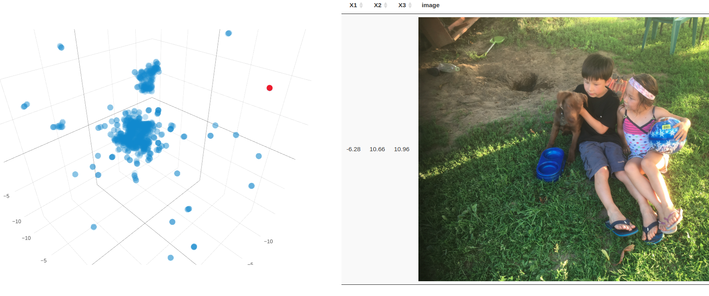

# image_clustering
R scripts to cluster your images

Put all your images in a folder, then the script will create high dimensional feature vectors using a VGG16 deeplearning model.The dimension is 25.088, which is hard to visualize, so then use a UMAP dimension reduction to bring it back to 3.

A 3 dimensional data set can be plotted with plotly, to link to the original images use crosstalk. So that when hovering over a point you will get to see the image.

